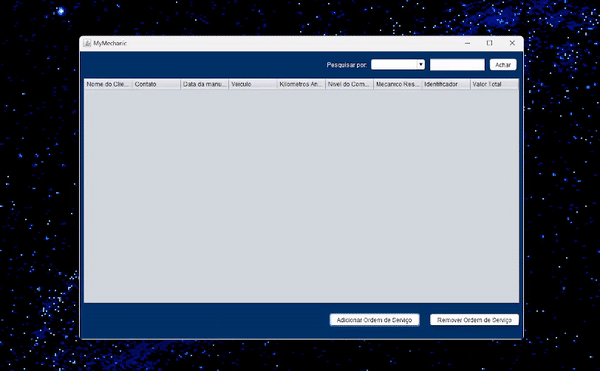
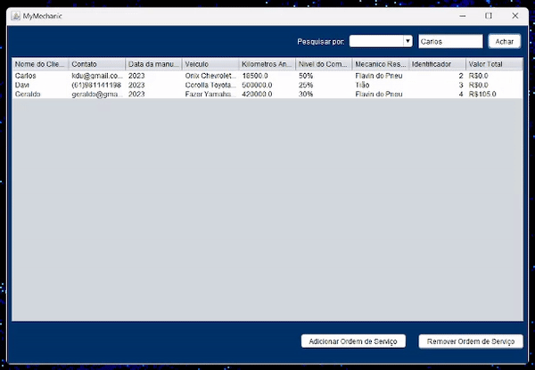

# Trabalho Orientação a Objetos

O software desenvolvido tem com objetivo realizar o gerenciamento de ordens de serviços de oficinas mecânicas. Conta com 4 (quatro) interfaces:

- Interface principal: Nela se encontra a tabela de ordens de serviços, e os botões para adicionar nova ordem, ou excluir ordem existente.

- Interface de registro de ordem de serviço: Nessa interface, se encontram dois formulários, são eles, o de cadastro de cliente, e o de cadastro de veículos. Ao final desses formularios, se encontram dois botões que realizam o redirecionamento para outras duas interfaces de cadastro de peças e serviços. Ainda na interface de registro de ordem de serviço, se encontram duas tabelas que exibem as peças e os serviços cadastrados na ordem de serviço atual.

- Interface de cadastro de peças/serviços: Nessa interface, é realizado o cadastro das peças ou dos serviços, isso é possível devido ao polimorfismo de construtores. Como peças e servicos possuem atributos em comum, é possível fazer um unico formulario que serve para ambos e que dependendo do paramentro de construção da classe, se comporta de uma maneira diferente. Quando o construtor receber um objeto "peça", além de carregar os campos em comum de peças e serviços, carrega também um painel (JPanel) que contém campos específicos da classe em questão, idem para quando recebe o objeto "serviço".

- Interface de visualização de peças e serviços: Ao duplo-clique em uma linha no JPanel da interface principal, é aberta uma tela contendo as informações sobre as peças trocadas e os serviços realizados.

## Diagrama de Classes

A seguir estão descritas as classes presentes em Model.

 

## Organização do sistema

O sistema foi desenvolvido utilizando o padrão Model View Controller (MVC), onde: no model, estão presentes as classes bases para o funcionamento do sistema (descritas no diagrama de classes), no view, estão presentes as interfaces gráficas, e no controller as classes que fazem a integração entre o Model e o View.
Por exemplo, o método que realiza o calculo do valor final da ordem de serviço está presente na classe "ServiceOrder" (Model), porém, ele é chamado na classe "OrderRegisterController" (Controller) e o output é exibido na Interface Principal (View).

## Casos de uso

  
- Criar ordem de serviço:

 

<ol type=1">
<li>Clicar no botão "Adicionar Ordem de Serviço";</li>
<li>Preencher o formulário com as informações necessarias;</li>
<li>Clicar no botão "adicionar peça";</li>
<li>Preencher o formulario com as informações da referida peça;</li>
<li>Clicar no botão "Confirmar";</li>
<li>Clicar no botão "Adicionar serviço";</li>
<li>Preencher o formulario com as informações do serviço realizado;</li>
<li>Clicar em confirmar;</li>
<li>Clicar em confirmar.</li>
</ol>

- Apagar ordem de serviço:

 

<ol type="1">
<li>Selecionar na tabela a linha a ser removida;</li>
<li>Cicar em "Remover Ordem de Serviço".</li>
</ol>

- Visualizar informações sobre peça e serviços:

 

<ol type="1">
<li>Na tabela principal, duplo-clique na linha desejada </li>
</ol>
